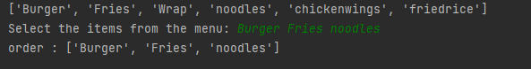

## Lists - Restaurant Waiter Helper program
### Summary
- Now that we've created had some time to use our lists, time to make something more useful.

- You are going to make a program that helps a waiter with his menu and his orders.
- See tasks for the user stories

### User Stories
- As a User I want to be able to see the menu in a formated way, so that I can order my meal.
- As a User I want to be able to order 3 times, and have my responses added to a list so they aren't forgotten.
- As a user, I want to have my order read back to me in formated way so I know what I ordered.
```python
# AS a User I want to be able to see the menu in a formated way, so that I can order my meal.
menu_list=["Burger","Fries","Wrap","noodles","chickenwings","friedrice"]
print(menu_list)
#AS a User I want to be able to order 3 times, and have my responses added to a list so they aren't forgotten

customer_selected_items=input("Select the items from the menu: ").split()

 # As a user, I want to have my order read back to me in formated way so I know what I ordered.

print("order :" ,customer_selected_items)
```
#### output of python program
